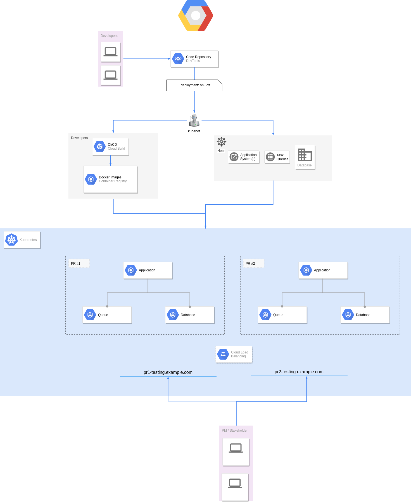

# Part 2

## Question

A company have multiple developers working on different features/bug fixes at the same time. Everytime a developer finishes work, one needs to open a merge request in Gitlab (same as a pull request in Github) to request for code review.

However, while the merge request is open, the project managers and other stakeholders cannot test the new feature/bug fix.

How to improve this process? So that people can test the new feature/bug fix before the merge request gets merged to stable branch.

## Solution

We could utilize the power of helm, kubernetes, CI/CD to create such kind of environment

- For each PR, developers could trigger the testing environment by commenting in the PR with a message like `deployment: on`

- We'll have a application (let's call it `kubebot` for now, can be either a lambda function, kubernetes application or anywhere for convenience) which listen for `gitlab web-hook`, once it receives such commits like that, it will trigger the following deployment steps:

  - A docker image built by CI/CD contains PR source code  - *serviceA:\<branch-name>*
  - A helm chart which has a dependency of serviceA, serviceB, database as a sub charts to sandbox cluster

  - The endpoints with following naming convention would be exposed: *\<pr-name>-testing.example.com*

  - A database pod with minimal dump data (also under version control), just enough for service startup would be created

- Once finish, the developer / PM / stakeholder could add a comment like `deployment: off`, to let `kubebot` knows that testing is done.

- `kubebot` receive the web-hook, start decommissioning the testing resources.

## Diagram

